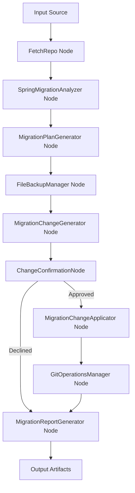

# Spring Migration Tool - Technical Documentation

## Table of Contents

1. [Architecture Overview](#architecture-overview)
2. [Core Components](#core-components)
3. [Processing Workflow](#processing-workflow)
4. [Node Documentation](#node-documentation)
5. [Safety and Backup Systems](#safety-and-backup-systems)
6. [Git Integration](#git-integration)
7. [LLM Analysis Engine](#llm-analysis-engine)
8. [Configuration and Customization](#configuration-and-customization)
9. [Error Handling and Recovery](#error-handling-and-recovery)
10. [Performance Considerations](#performance-considerations)
11. [API Reference](#api-reference)
12. [Development Guide](#development-guide)

## Architecture Overview

The Spring Migration Tool is built on the **PocketFlow** framework, implementing a node-based workflow architecture for analyzing and migrating Spring Framework projects from version 5.x to 6.x.

### High-Level Architecture



### Design Principles

1. **Modularity**: Each migration step is encapsulated in dedicated nodes
2. **Safety First**: Multiple confirmation points and automatic backup creation
3. **Intelligent Analysis**: LLM-powered context-aware code analysis
4. **Reversibility**: Complete rollback capabilities through Git and file backups
5. **Transparency**: Detailed reporting and change previews

### Technology Stack

- **Framework**: PocketFlow (100-line LLM framework)
- **Language**: Python 3.8+
- **LLM Integration**: Configurable (Google Gemini, OpenAI, etc.)
- **Version Control**: Git integration
- **File Processing**: Multi-format support (Java, XML, Properties, YAML)
- **Output Formats**: JSON, Markdown, structured reports

## Core Components

### 1. Source Code Analysis Engine

**Purpose**: Analyzes Spring codebases to identify migration requirements

**Key Features**:
- Multi-file type support (Java, XML, Properties, YAML, Gradle, Maven)
- Pattern-based filtering for Spring-specific files
- Size-based file handling with intelligent truncation
- Encoding detection and safety validation

**Supported File Types**:
```python
SPRING_INCLUDE_PATTERNS = {
    "*.java", "*.xml", "*.properties", "*.yml", "*.yaml", 
    "*.gradle", "*.gradle.kts", "pom.xml", "*.sql", "*.jpa",
    "*.jsp", "*.jspx", "*.tag", "*.tagx"
}
```

### 2. LLM Analysis Engine

**Purpose**: Provides intelligent, context-aware migration analysis

**Capabilities**:
- Semantic code understanding beyond pattern matching
- Line-by-line change identification with precise locations
- Safety classification (automatic vs. manual review)
- Detailed explanations for required changes
- Project size-based effort estimation

**Analysis Categories**:
- Framework and dependency audit
- Jakarta namespace impact assessment
- Configuration analysis
- Spring Security migration requirements
- Data layer compatibility
- Web layer updates
- Testing framework migration
- Build tooling updates

### 3. Change Application System

**Purpose**: Safely applies approved migration changes to source files

**Change Types**:

#### Automatic Changes (Safe)
- `javax.*` to `jakarta.*` namespace migration
- Import statement updates
- Package reference corrections
- Basic configuration property updates

#### Manual Review Required
- Spring Security configuration updates
- Dependency version updates
- Complex configuration patterns
- Custom authentication logic

### 4. Backup and Recovery System

**Purpose**: Ensures safe migration with complete rollback capabilities

**Features**:
- Timestamped backup creation
- Complete file preservation
- Backup manifest generation
- Easy restoration process

### 5. Git Integration System

**Purpose**: Provides seamless version control integration

**Capabilities**:
- Automatic branch creation
- Change staging and committing
- Remote push operations
- Pull request template generation

## Processing Workflow

### Phase 1: Input and Preparation

1. **Source Identification**
   - GitHub repository URL parsing
   - Local directory validation
   - Authentication token handling

2. **File Discovery**
   - Pattern-based file filtering
   - Size validation and limits
   - Encoding detection
   - Content preparation

### Phase 2: Analysis and Planning

3. **LLM-Powered Analysis**
   - Comprehensive codebase examination
   - Context-aware pattern detection
   - Migration complexity assessment
   - Effort estimation calculation

4. **Migration Plan Generation**
   - Phase breakdown creation
   - Task prioritization
   - Automation recommendations
   - Risk assessment

### Phase 3: Change Preparation

5. **Backup Creation**
   - Complete file backup
   - Manifest generation
   - Timestamp preservation

6. **Change Generation**
   - File-by-file LLM analysis
   - Specific change identification
   - Safety classification
   - Line number mapping

### Phase 4: User Interaction

7. **Change Confirmation**
   - Detailed change preview
   - Interactive approval process
   - Granular control options

### Phase 5: Application and Reporting

8. **Change Application** (if approved)
   - Safe file modification
   - Error handling and recovery
   - Progress tracking

9. **Git Operations** (if enabled)
   - Branch creation
   - Change staging
   - Commit generation
   - Remote operations

10. **Report Generation**
    - Comprehensive JSON reports
    - Human-readable summaries
    - Backup documentation

## Node Documentation

### FetchRepo Node

**Purpose**: Retrieves source code from GitHub repositories or local directories

**Input Parameters**:
- `repo_url`: GitHub repository URL
- `local_dir`: Local directory path
- `github_token`: Authentication token
- `include_patterns`: File inclusion patterns
- `exclude_patterns`: File exclusion patterns
- `max_file_size`: Maximum file size limit

**Output**: List of `(file_path, content)` tuples

**Key Methods**:
- `prep()`: Prepares crawling parameters
- `exec()`: Executes file crawling
- `post()`: Stores results in shared context

### SpringMigrationAnalyzer Node

**Purpose**: Performs comprehensive LLM-powered Spring migration analysis

**Input**: File list and project metadata

**Output**: Structured JSON analysis report

**Analysis Components**:
```json
{
  "executive_summary": {
    "migration_impact": "string",
    "key_blockers": ["string"],
    "recommended_approach": "string"
  },
  "detailed_analysis": {
    "framework_audit": {},
    "jakarta_migration": {},
    "configuration_analysis": {},
    "security_migration": {},
    "data_layer": {},
    "web_layer": {},
    "testing": {},
    "build_tooling": {}
  },
  "effort_estimation": {
    "total_effort": "string",
    "by_category": {},
    "priority_levels": {}
  }
}
```

**Error Handling**:
- JSON parsing error recovery
- Response cleaning and validation
- Fallback analysis generation
- Retry mechanisms with exponential backoff

### MigrationChangeGenerator Node

**Purpose**: Generates specific file-level migration changes using LLM analysis

**Input**: File content and migration analysis

**Output**: Categorized change list

**Change Categories**:
- `javax_to_jakarta`: Namespace migrations
- `spring_security_updates`: Security configuration changes
- `dependency_updates`: Build file modifications
- `configuration_updates`: Property and YAML changes
- `other_changes`: Miscellaneous updates

**Change Structure**:
```json
{
  "file": "path/to/file.java",
  "type": "import_replacement",
  "from": "javax.persistence.Entity",
  "to": "jakarta.persistence.Entity",
  "description": "Replace javax import with jakarta import",
  "line_numbers": [5],
  "automatic": true,
  "explanation": "Standard javax to jakarta namespace migration"
}
```

**LLM Integration**:
- Context-aware file analysis
- Line-by-line change detection
- Safety classification
- Detailed explanation generation

### ChangeConfirmationNode Node

**Purpose**: Provides interactive user confirmation for migration changes

**Features**:
- Detailed change preview
- Category-based organization
- Interactive approval process
- Granular control options

**User Interface**:
```
🔍 SPRING MIGRATION CHANGES PREVIEW
============================================================
Found 24 changes across 3 categories:

📂 Javax To Jakarta (18 changes):
   1. User.java: Replace javax.persistence import
   2. Order.java: Replace javax.validation import
   ...

⚠️  IMPORTANT: This will modify your source files!
🤔 Apply these migration changes? [y/N/preview]:
```

### MigrationChangeApplicator Node

**Purpose**: Safely applies approved migration changes to source files

**Safety Features**:
- Local-only operation (no GitHub modification)
- Atomic file operations
- Error handling and rollback
- Progress tracking and reporting

**Change Application Methods**:

#### Import Replacement
```python
def _apply_import_replacement(self, change, local_dir):
    # Handles javax.* to jakarta.* migrations
    # Uses regex patterns for precise matching
    # Preserves formatting and structure
```

#### Configuration Updates
```python
def _apply_configuration_update(self, change, local_dir):
    # Updates properties and YAML files
    # Handles different file formats
    # Validates changes before application
```

### GitOperationsManager Node

**Purpose**: Manages Git version control operations for migration changes

**Operations**:
1. Repository status analysis
2. Change detection and staging
3. Branch creation with timestamps
4. Commit generation with detailed messages
5. Remote push operations
6. Pull request template creation

**Git Workflow**:
```bash
# Automatic branch creation
git checkout -b spring-migration-20241215_143022

# Change staging
git add .

# Commit creation
git commit -m "Spring 5 to 6 Migration - Automated Changes"

# Remote push (optional)
git push -u origin spring-migration-20241215_143022
```

### MigrationReportGenerator Node

**Purpose**: Generates comprehensive migration reports

**Output Files**:
- `{project}_spring_migration_report.json`: Detailed JSON report
- `{project}_migration_summary.md`: Human-readable summary
- `backup_manifest.json`: Backup documentation

**Report Structure**:
```json
{
  "project_name": "MySpringApp",
  "analysis_date": "2024-12-15T14:30:22",
  "migration_analysis": {},
  "migration_plan": {},
  "backup_info": {},
  "applied_changes": {},
  "recommendations": {}
}
```

## Safety and Backup Systems

### Automatic Backup System

**Implementation**: `FileBackupManager` node

**Features**:
- Timestamped backup directories
- Complete file preservation
- Backup manifest generation
- Easy restoration process

**Backup Structure**:
```
MyProject_backup_20241215_143022/
├── backup_manifest.json
├── src_main_java_com_example_User.java
├── src_main_java_com_example_Order.java
└── pom.xml
```

**Restoration Process**:
```python
# Automatic restoration from manifest
def restore_from_backup(backup_dir):
    with open(f"{backup_dir}/backup_manifest.json") as f:
        manifest = json.load(f)
    
    for file_info in manifest["files_backed_up"]:
        # Restore each file to original location
        shutil.copy(file_info["backup_path"], file_info["original_path"])
```

### Interactive Confirmation System

**Multi-level Confirmation**:
1. Change preview with detailed breakdown
2. User approval for file modifications
3. Git operation confirmation
4. Remote push approval

**Safety Checkpoints**:
- Pre-modification backup creation
- Change validation before application
- Error handling with rollback capabilities
- Progress tracking and logging

### Error Recovery

**Automatic Recovery**:
- JSON parsing error handling
- File operation error recovery
- Git operation rollback
- Backup-based restoration

**Manual Recovery Options**:
- Complete backup restoration
- Git branch deletion
- Selective file recovery
- Configuration reset

## Git Integration

### Branch Management

**Automatic Branch Creation**:
```python
def _create_migration_branch(self, project_name):
    timestamp = datetime.now().strftime("%Y%m%d_%H%M%S")
    branch_name = f"spring-migration-{timestamp}"
    subprocess.run(["git", "checkout", "-b", branch_name])
    return branch_name
```

**Branch Naming Convention**: `spring-migration-{YYYYMMDD_HHMMSS}`

### Commit Message Generation

**Automatic Commit Messages**:
```
Spring 5 to 6 Migration - Automated Changes

- Applied 12 automatic migration changes
- 5 changes marked for manual review
- Jakarta namespace migration (javax.* → jakarta.*)
- Updated import statements and references

Generated by AI Codebase Migration Tool
Project: MySpringApp
Date: 2024-12-15 14:30:22
```

### Pull Request Templates

**Auto-generated PR Information**:
- Descriptive title with project name
- Detailed change summary
- Manual review checklist
- Testing guidelines
- Generated labels and metadata

## LLM Analysis Engine

### Prompt Engineering

**System Prompt Structure**:
1. Role definition and expertise areas
2. Context provision (project files and metadata)
3. Specific analysis requirements
4. Output format specifications
5. Safety and validation rules

**Context Management**:
- File content truncation for large files
- Intelligent content selection
- Context size optimization
- Multi-file relationship analysis

### Response Processing

**JSON Extraction and Validation**:
```python
def _extract_and_clean_json(self, response, file_path):
    # Clean response text
    response = response.strip()
    
    # Extract JSON block
    if "```json" in response:
        json_str = response.split("```json")[1].split("```")[0]
    
    # Clean and validate
    json_str = self._clean_json_string(json_str)
    
    # Bracket balancing
    json_str = self._balance_brackets(json_str)
    
    return json_str
```

**Error Handling**:
- JSON parsing error recovery
- Response cleaning and fixing
- Fallback analysis generation
- Retry mechanisms

### Caching System

**LLM Response Caching**:
- Configurable caching (`--no-cache` option)
- Retry-aware caching (fresh analysis on retries)
- Memory-based caching for development
- Performance optimization

## Configuration and Customization

### File Pattern Configuration

**Include Patterns** (Spring-specific):
```python
SPRING_INCLUDE_PATTERNS = {
    "*.java", "*.xml", "*.properties", "*.yml", "*.yaml", 
    "*.gradle", "*.gradle.kts", "pom.xml", "*.sql", "*.jpa",
    "*.jsp", "*.jspx", "*.tag", "*.tagx"
}
```

**Exclude Patterns** (Build artifacts and tests):
```python
SPRING_EXCLUDE_PATTERNS = {
    "target/*", "build/*", "*.class", "*.jar", "*.war", "*.ear",
    "*test*", "*tests/*", "src/test/*", "test/*",
    ".git/*", ".idea/*", ".vscode/*", "node_modules/*",
    "**/generated/*", "**/generated-sources/*"
}
```

### LLM Configuration

**Provider Selection**: Configurable in `utils/call_llm.py`
- Google Gemini (default)
- OpenAI GPT models
- Anthropic Claude
- Local models via Ollama

**Configuration Example**:
```python
def call_llm(prompt, use_cache=True):
    client = genai.Client(
        api_key=os.getenv("GEMINI_API_KEY"),
    )
    
    response = client.models.generate_content(
        model="gemini-2.0-flash-exp",
        contents=prompt,
        config={"temperature": 0.1}
    )
    
    return response.text
```

### Output Customization

**Report Configuration**:
- Output directory selection
- Report format options
- Detail level configuration
- Custom naming patterns

## Error Handling and Recovery

### Error Categories

1. **Input Errors**:
   - Invalid repository URLs
   - Missing authentication tokens
   - Inaccessible local directories

2. **Processing Errors**:
   - LLM API failures
   - JSON parsing errors
   - File operation failures

3. **Git Errors**:
   - Repository access issues
   - Branch creation failures
   - Push operation errors

### Recovery Strategies

**Automatic Recovery**:
```python
def exec_fallback(self, prep_res, exc):
    # Graceful fallback for LLM failures
    return self._get_fallback_analysis(prep_res)

def _attempt_json_fix(self, response):
    # Automatic JSON repair for parsing errors
    return self._balance_brackets(self._clean_json(response))
```

**Manual Recovery**:
- Backup-based file restoration
- Git repository reset
- Configuration validation
- Step-by-step debugging

### Logging and Debugging

**Comprehensive Logging**:
- Progress tracking
- Error details and context
- Performance metrics
- Debug information

**Debug Output Example**:
```
📁 Fetching repository: https://github.com/user/spring-app
✅ Fetched 45 files
🤖 Analyzing Spring codebase for migration...
📊 Generated 24 specific migration changes
💾 Created backup: ./output/MyApp_backup_20241215_143022
🔧 Applied 18 automatic changes successfully
```

## Performance Considerations

### File Processing Optimization

**Content Truncation**:
- Large file intelligent truncation
- Import and class structure preservation
- Context size optimization
- Memory usage management

**Parallel Processing**:
- File analysis parallelization potential
- I/O optimization
- Memory-efficient streaming

### LLM Optimization

**Request Optimization**:
- Context size management
- Prompt engineering for efficiency
- Response caching
- Rate limit handling

**Cost Management**:
- Token usage optimization
- Selective analysis
- Caching strategies
- Batch processing potential

### Memory Management

**Large Project Handling**:
- Streaming file processing
- Memory-efficient data structures
- Garbage collection optimization
- Resource cleanup

## API Reference

### Command Line Interface

```bash
# Basic usage
python main.py [--repo URL | --dir PATH] [options]

# Required (mutually exclusive)
--repo URL          # GitHub repository URL
--dir PATH          # Local directory path

# Optional
-n, --name NAME     # Project name
-t, --token TOKEN   # GitHub token
-o, --output DIR    # Output directory
-i, --include PATTERN  # Include patterns
-e, --exclude PATTERN  # Exclude patterns
-s, --max-size SIZE    # Max file size
--no-cache             # Disable LLM caching
--apply-changes        # Apply migration changes
--git-integration      # Enable Git operations
```

### Python API

**Flow Creation**:
```python
from flow import create_spring_migration_flow

# Create flow instance
flow = create_spring_migration_flow()

# Configure shared context
shared = {
    "repo_url": "https://github.com/user/spring-app",
    "include_patterns": SPRING_INCLUDE_PATTERNS,
    "apply_changes": True,
    "git_integration": True
}

# Execute migration
flow.run(shared)
```

**Node Integration**:
```python
from nodes import SpringMigrationAnalyzer

# Create and configure node
analyzer = SpringMigrationAnalyzer()

# Execute analysis
result = analyzer.run(shared_context)
```

### Data Structures

**Shared Context Structure**:
```python
shared = {
    # Input configuration
    "repo_url": str,
    "local_dir": str,
    "project_name": str,
    "github_token": str,
    "include_patterns": set,
    "exclude_patterns": set,
    "max_file_size": int,
    "apply_changes": bool,
    "git_integration": bool,
    
    # Processing data
    "files": List[Tuple[str, str]],
    "migration_analysis": dict,
    "migration_plan": dict,
    "migration_changes": dict,
    "applied_changes": dict,
    "backup_info": dict,
    "git_operations": dict,
    
    # Output
    "final_output_dir": str
}
```

**Change Structure**:
```python
change = {
    "file": str,
    "type": str,
    "from": str,
    "to": str,
    "description": str,
    "line_numbers": List[int],
    "automatic": bool,
    "explanation": str,
    "requires_manual_review": bool
}
```

## Development Guide

### Adding New Migration Patterns

1. **Extend MigrationChangeGenerator**:
```python
def _analyze_custom_pattern(self, file_path, content):
    # Custom pattern detection logic
    changes = []
    
    # Pattern matching and change generation
    if "old_pattern" in content:
        changes.append({
            "file": file_path,
            "type": "custom_replacement",
            "from": "old_pattern",
            "to": "new_pattern",
            "automatic": True
        })
    
    return changes
```

2. **Update Change Categories**:
```python
# Add new category to change structure
changes = {
    "custom_changes": [],  # New category
    # ... existing categories
}
```

3. **Implement Change Application**:
```python
def _apply_custom_change(self, change, local_dir):
    # Custom change application logic
    pass
```

### Extending LLM Analysis

**Custom Prompts**:
```python
def _create_custom_analysis_prompt(self, context):
    return f"""
    # Custom Analysis Prompt
    
    Analyze the following code for custom migration requirements:
    {context}
    
    Focus on:
    - Custom framework patterns
    - Specific library migrations
    - Domain-specific requirements
    
    Output format: {self._get_output_format()}
    """
```

**Response Processing**:
```python
def _process_custom_response(self, response):
    # Custom response processing logic
    analysis = self._parse_custom_response(response)
    return self._validate_custom_analysis(analysis)
```

### Testing Strategy

**Unit Testing**:
```python
import unittest
from nodes import SpringMigrationAnalyzer

class TestMigrationAnalyzer(unittest.TestCase):
    def test_javax_to_jakarta_detection(self):
        analyzer = SpringMigrationAnalyzer()
        # Test implementation
```

**Integration Testing**:
```python
def test_full_migration_workflow():
    # Test complete workflow
    flow = create_spring_migration_flow()
    shared = create_test_context()
    result = flow.run(shared)
    assert_migration_success(result)
```

**Mock Testing**:
```python
@patch('utils.call_llm.call_llm')
def test_llm_analysis(mock_llm):
    mock_llm.return_value = get_test_analysis_response()
    # Test LLM integration
```

### Contributing Guidelines

1. **Code Style**: Follow PEP 8 standards
2. **Documentation**: Comprehensive docstrings for all methods
3. **Testing**: Unit tests for new functionality
4. **Error Handling**: Graceful error handling and recovery
5. **Logging**: Appropriate logging for debugging
6. **Safety**: Backup and rollback capabilities

### Deployment Considerations

**Production Setup**:
- Environment variable configuration
- LLM API key management
- Resource limit configuration
- Monitoring and alerting

**Scaling Considerations**:
- Large repository handling
- Concurrent analysis support
- Resource optimization
- Performance monitoring

---

This documentation provides a comprehensive overview of the Spring Migration Tool's architecture, functionality, and implementation details. For specific usage examples and troubleshooting, refer to the main README.md file. 